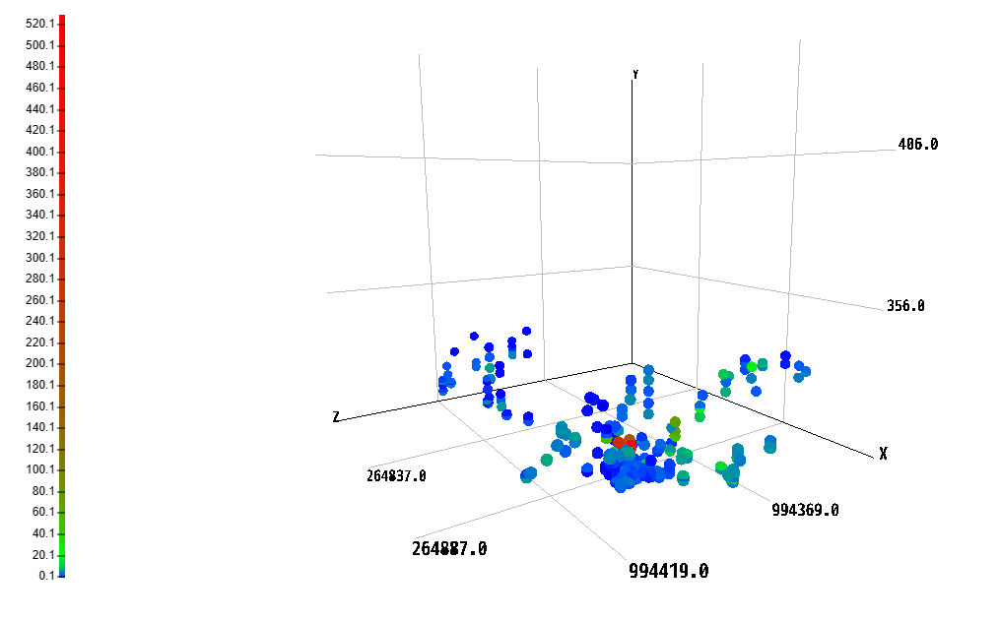
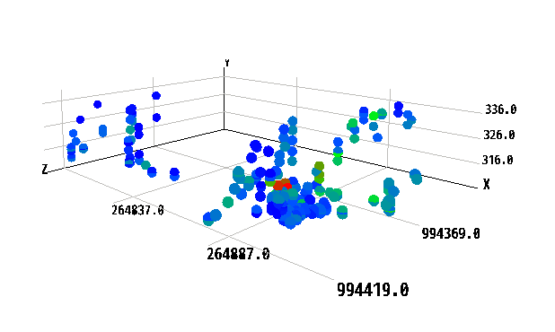
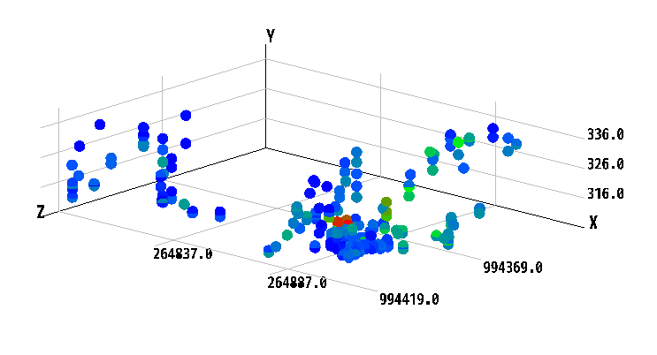
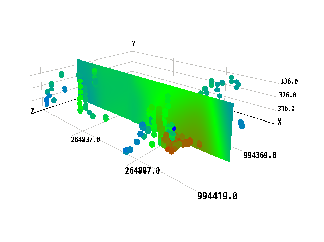

# point-cloud-viewer.js

**does not work on itself** based on THREE.js and implements functions to view point clouds in the browser

# Modes

## square-mode off and perspective-mode on

## square-mode off and ortho-mode on

## interpolation plane

